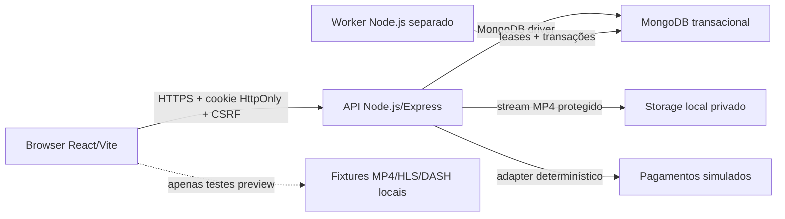

# Arquitetura técnica da FaithFlix

- `last_updated`: `2026-07-11`
- `implementation_root`: `real_dev`
- `scope`: baseline local da referência docente
- `production_gate`: `NO_GO_PRODUCAO`

Este documento descreve a implementação de referência em `real_dev`. As pastas
`backend/` e `frontend/` da raiz pertencem aos alunos e não são descritas como
se estivessem automaticamente sincronizadas com esta baseline.

## Contexto do sistema

Não existe nesta baseline gateway de pagamentos, CDN, transcoding, DRM,
deployment cloud, CI remoto ou backup agendado. A ingestão de vídeo usa apenas
MP4 progressive num diretório local privado; o adapter financeiro e as fixtures
HLS/DASH de browser são explicitamente simulados.

## Processos executáveis

### Frontend

O frontend React/Vite vive em `real_dev/frontend`. O cliente API:

- usa cookies de sessão com `credentials: "include"`;
- mantém o token CSRF apenas em memória;
- aplica timeout e cancelamento com `AbortController`;
- distingue sessão autenticada, anónima e temporariamente indisponível;
- carrega páginas e adapters HLS/DASH por `import()` quando necessários.

O lifecycle de navegação é centralizado: `ErrorBoundary` contém falhas de
renderização, `React.lazy`/`Suspense` separa as páginas do chunk inicial e uma
metadata allowlisted define o título de cada rota. O scroll e o foco no
conteúdo principal só são repostos quando muda o `pathname`; alterar apenas a
query string preserva o contexto de pesquisa, filtros e paginação.

### API HTTP

A API Express vive em `real_dev/backend`. `app.js` compõe middlewares e rotas,
mas não abre portas; `server.js` prepara índices, abre o servidor e gere o ciclo
de vida do processo. Desenvolvimento/teste fazem bind em loopback por defeito;
produção exige um `HOST` explícito.

As fronteiras comuns são, por ordem lógica:

1. request id e logs estruturados;
2. headers defensivos, HTTPS e CORS allowlisted;
3. liveness/readiness sem sessão;
4. parsing JSON limitado;
5. sessão server-side, CSRF e autorização;
6. routers de domínio;
7. envelope de erro seguro.

### Worker financeiro

`real_dev/backend/src/worker.js` é um processo separado da API. Usa leases
MongoDB para impedir duplicação e processa:

- trials, renovações simuladas, expirações e cancelamentos;
- fecho da pool do mês UTC anterior;
- catch-up limitado de períodos em atraso.

O worker exige uma topologia MongoDB com transações. Não existe fallback
standalone nem segundo caminho de renovação por pedido HTTP.

## Módulos de domínio backend

| Área | Responsabilidade principal |
| --- | --- |
| `auth`, `users` | identidade, password, sessão, perfis, parental e administração de contas |
| `catalog`, `biblical-passages` | metadata editorial, taxonomias, publicação, revisões CAS e passagens associadas |
| `playback`, `library` | entitlement, fonte canónica, progresso, favoritos, watchlist e histórico |
| `ratings`, `comments` | interação autenticada, agregação e moderação |
| `search`, `discovery`, `recommendations` | pesquisa pública, descoberta e recomendação condicionada por consentimento |
| `payments`, `subscriptions` | checkout/trial idempotente, ledger v2, ciclos e família |
| `charities` | candidaturas, memberships, pool, dashboard e histórico |
| `privacy`, `notifications`, `audit` | consentimentos, RGPD, preferências, outbox e auditoria minimizada |
| `jobs`, `system` | leases, ciclo do worker, health e informação técnica da API |

Os routers não devem aceder diretamente ao driver. Controllers validam o
contrato HTTP e services recebem `db/session` quando participam numa transação.

## Persistência e consistência

MongoDB é a persistência autoritativa. As operações críticas usam
`runInTransaction`; produção deve falhar cedo se a topologia não suportar
sessões e transações multi-documento.

As invariantes principais são:

- idempotência por `Idempotency-Key` e `requestHash` em checkout/trial;
- compare-and-swap por `version/expectedVersion` no catálogo;
- séries são agregados não reproduzíveis; cada episódio referencia uma série por
  `seriesId` e ocupa uma posição única `{ seasonNumber, episodeNumber }`;
- lugares familiares recontados dentro da transação e índices únicos;
- planos incompletos nunca recebem defaults de qualidade/lugares e são
  recusados antes de listagem pública, checkout e renovação;
- só admins autenticáveis `active` (ou legacy sem estado) contam para a
  invariante do último admin;
- ledger financeiro v2 imutável para a pool mensal;
- leases únicos por subscrição/ciclo e por mês;
- audit log dentro da mesma transação da alteração crítica; o helper recusa
  escrita fora de `runInTransaction`;
- passagens bíblicas/associações, moderação privilegiada, integrações e fecho
  manual da pool seguem o mesmo contrato de ator, `requestId`, sessão e
  snapshot mínimo. Em comentários, `comment.moderated` e
  `comment.privileged_delete` guardam apenas estados; corpo, motivo livre e PII
  ficam fora do audit, e a remoção normal pelo autor não é um evento admin.

Os testes atuais provam estas fronteiras com doubles/fault injection, e o smoke
read-only da demo passou contra a base Atlas `_demo` verificada. O E2E funcional
destrutivo de séries permanece preparado, mas não foi executado porque este
ambiente não disponibiliza o replica set loopback dedicado terminado em
`_e2e` exigido pelo guard formal.

### Coleções operacionais e schemas autoritativos

| Coleção | Campos/invariantes relevantes | Índices e lifecycle |
| --- | --- | --- |
| `sessions` | `userId`, `tokenHash`, `createdAt`, `expiresAt`; após rotação CSRF inclui `csrfTokenHash`, `csrfRotatedAt` e `csrfTokenHashes`, uma lista limitada às quatro rotações mais recentes com `{ hash, createdAt }`. Só hashes são persistidos; o token bruto fica no cliente em memória. | `tokenHash` único e TTL em `expiresAt`; a validade é absoluta de 24 horas e não é prolongada por atividade. |
| `rate_limit_counters` | `scope`, `keyHash`, `windowStart`, `count`, `expiresAt`. `keyHash` é HMAC SHA-256 de IP, email, token ou utilizador com pepper de ambiente; o identificador bruto não é guardado. | Índice único `{ scope, keyHash, windowStart }` e TTL em `expiresAt`, definido para `windowStart + 2 * windowMs`; a decisão de bloqueio usa apenas a janela corrente. |
| `scheduled_jobs` | `key`, `type`, `status`, `nextRunAt`, `attempts`, timestamps; durante execução inclui `leaseOwner` e `leaseExpiresAt`; falhas persistem apenas `lastErrorCode` sanitizado. Estados permitidos: `idle`, `running`, `failed`, `completed`. | `key` único, seleção por `{ status, nextRunAt }` e recuperação por `leaseExpiresAt`; claim/complete/fail exigem ownership do lease. |
| `payment_attempts` v2 | `schemaVersion: 2`, `operation`, `userId`, `planCode`, `provider`, `status`, `amountCents`, `currency`, `solidaritySharePercent`, `interval`, `approvedAt`, `cycle`, `idempotencyKey`, `requestHash`, `response`, `accountingEstimate`, `createdAt`, `updatedAt`. Novos pagamentos usam `accountingEstimate: false`; backfills permanecem identificados como estimativa. | Unicidade idempotente por utilizador/chave e índices parciais de consulta contabilística. O snapshot financeiro aprovado é imutável para o fecho mensal. |
| `contents` | Metadata editorial, discriminador `type`, `version` (CAS) e `mediaStatus` fechado em `pending`, `ready` ou `failed`. `series` não contém media; `episode` exige `seriesId`, `seasonNumber` e `episodeNumber` positivos. Filmes, documentários e episódios podem referenciar o asset privado ativo. | `slug` é globalmente único. Episódios têm índice parcial único `{ seriesId, seasonNumber, episodeNumber }`; catálogo, pesquisa e recomendações públicas excluem episódios soltos. As queries de disponibilidade usam `isPlayable: true` e metadata editorial, sem expor storage. |
| `media_assets` | `contentId`, `storageKey` opaco, qualidade, MIME MP4, tamanho, SHA-256, estado e timestamps. Um upload permanece isolado como `.partial` até validação integral e ativação CAS. | Consulta por conteúdo/estado; apenas um asset ativo por conteúdo e qualidade. O lifecycle de abort/erro elimina ficheiros parciais, sem substituir antecipadamente a fonte ativa. |

O schema das coleções é descrito pelo contrato de escrita da aplicação; não há
fallback que reconstrua silenciosamente dados financeiros históricos ou que
converta documentos media malformados em conteúdo reproduzível.

## Segurança e privacidade

- Cookie de sessão e registo server-side têm TTL absoluto de 24 horas.
- Mutações autenticadas exigem CSRF e origem browser válida.
- Rate limiting usa contadores MongoDB com TTL e chaves pseudonimizadas.
- Catálogo público nunca devolve fontes de media.
- Playback autentica, aplica subscrição, família, parental e qualidade antes de
  devolver uma única fonte.
- Recomendações pessoais dependem de consentimento; sem consentimento usam
  apenas cold start editorial.
- Logs e envelopes de erro não devem incluir URI, tokens, cookies, passwords,
  stack traces ou mensagens internas.

## Media

O catálogo pode publicar metadata sem vídeo. Nesse caso usa
`mediaStatus: "pending"`, `isPlayable: false` e o CTA fica desativado. Quando um
asset privado está `ready` e ativo, catálogo e playback partilham a mesma
canonicalização de protocolo, MIME e qualidade. O DTO de playback mantém
`{ url, protocol, mimeType }`, mas `url` aponta para `/api/media/:assetId`.

`GET|HEAD /api/media/:assetId` volta a verificar sessão, subscrição,
parentalidade, publicação e qualidade antes de abrir o ficheiro. O endpoint
suporta ranges `206/416`, nunca expõe `storageKey` ou paths locais e responde
sempre com `private, no-store`. O upload administrativo transmite o corpo para
um ficheiro parcial, valida tamanho, assinatura MP4 e SHA-256, e só depois pode
ser ativado por CAS.

O produto local ingere e reproduz apenas MP4 progressive. Os adapters seguintes
permanecem cobertos exclusivamente por fixtures sintéticas de browser:

- progressive: `<video src>`;
- HLS: suporte nativo ou `hls.js`;
- DASH: `dashjs`.

As fixtures MP4/HLS/DASH são sintéticas, pequenas e ficam na infraestrutura de
testes, nunca em `frontend/public`. Servem para validar adapters e eventos
`loadedmetadata/canplay`; não provam streaming real, 4K, ABR, CDN, DRM, carga ou
os tempos de RNF08/RNF10.

## Operação local

- `/health/live` representa apenas o processo HTTP.
- `/health/ready` verifica com budget curto que MongoDB tem topologia
  transacional; `/health` é o alias compatível de readiness.
- API e worker tratam `SIGTERM`/`SIGINT` sem encerrar MongoDB antes de concluir
  o trabalho ativo.
- Produção exige configuração explícita e falha fechada; desenvolvimento/teste
  preservam bind loopback e restantes defaults locais seguros.
- Backup e restore verification são operações locais opt-in. O restore usa
  sempre uma DB temporária gerada pelo script e nunca a origem.

Os procedimentos estão em `docs/runbooks/`. CI/deploy/rollback remoto e backup
diário automático permanecem riscos aceites da baseline local.

## Estratégia de validação

| Camada | Prova local |
| --- | --- |
| Backend | unitários, integração HTTP, segurança, concorrência com doubles e fault injection |
| Frontend | ESLint, Vitest/RTL, contratos e build production |
| Browser | Chromium/Firefox/WebKit para media sintética; Chromium+Axe para acessibilidade |
| Documentação | validador de 66 BK/guias, fences, paths públicos e whitespace |
| Operação | health negativo, shutdown unitário e guardas de backup/restore com doubles |

Nenhuma prova local deve ser promovida a evidência de produção sem ambiente,
media, credenciais rotacionadas, replica set, ferramentas e deployment reais.
